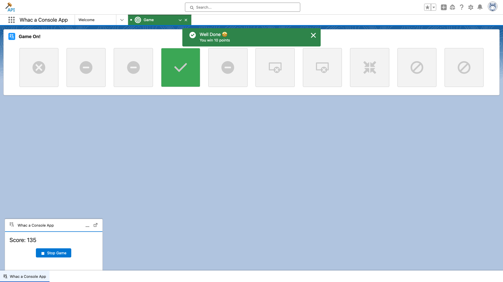

# Whac a Console App

This is a fun game of speed and skills that demonstrates how to navigate Console apps with LWC using the following capabilities:

-   [Workspace AP](https://developer.salesforce.com/docs/component-library/bundle/lightning-platform-workspace-api/documentation)
-   [Utility Bar API](https://developer.salesforce.com/docs/component-library/bundle/lightning-platform-utility-bar-api/documentation)
-   [Lightning Message Service](https://developer.salesforce.com/docs/component-library/bundle/lightning-message-service/documentation)



## Installation

Install the app by running this script:

**MacOS or Linux**

```
./install-dev.sh
```

**Windows**

```
install-dev.bat
```

The script automatically opens the game app but you can find it later in the **Whac a Console App**.
